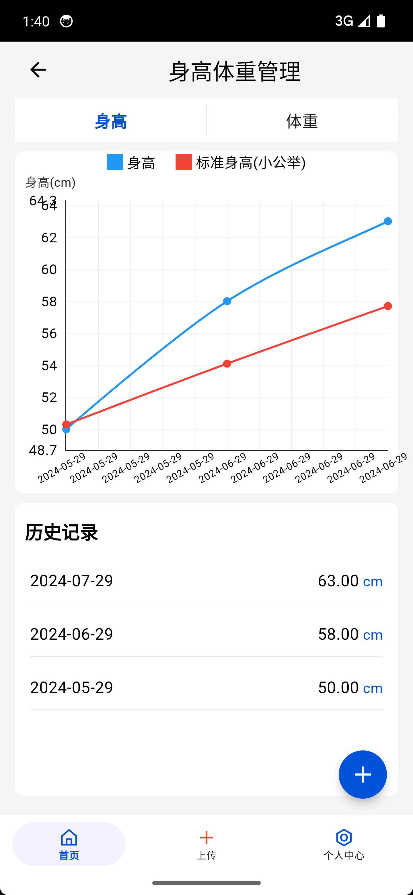

# Baby Time - 宝宝时光机

## 项目简介 (Project Introduction)

Baby Time 是一款专为家庭人员设计的宝宝记录和管理应用，帮助家长轻松追踪和记录宝宝的成长点滴。


## 效果图

<center class="half">
      
</center>

<center class="half">
      
</center>

<center class="half">
      
</center>

<center class="half">
      
</center>


<center class="half">
      
</center>


## 功能特点 (Features)

- 成长日记：记录宝宝的重要时刻和可爱瞬间
- 家庭人员管理：家庭成员管理和权限控制
- 家庭申请：家庭成员申请
- 成长曲线：记录宝宝身高、体重(TODO)等发育指标


## 技术栈 (Tech Stack)

- Flutter
- Dart
- Java + Spring Boot 3
## 开发环境准备 (Development Setup)

### 前提条件 (Prerequisites)

- Flutter SDK (最低版本: 3.0.0)
- Dart SDK
- Android Studio 或 VS Code
- Git

### 安装步骤 (Installation Steps)

1. 克隆仓库
```bash
git clone https://github.com/yourusername/baby-time.git
cd baby-time
```

2. 获取依赖
```bash
flutter pub get
```

3. 运行应用
```bash
flutter run
```

## 贡献指南 (Contributing)

1. Fork 仓库
2. 创建新分支 (`git checkout -b feature/amazing-feature`)
3. 提交修改 (`git commit -m '添加了一些很棒的功能'`)
4. 推送到分支 (`git push origin feature/amazing-feature`)
5. 提交 Pull Request

## 许可证 (License)

本项目采用 MIT 许可证 - 详见 [LICENSE](./LICENSE)

## 联系方式 (Contact)

- 项目维护者：[lee]
- 项目链接：[[q920447939/flutter_baby_time: 记录宝宝美丽的瞬间](https://github.com/q920447939/flutter_baby_time)](https://github.com/yourusername/baby-time)

## 致谢 (Acknowledgements)

- Flutter 团队
- 所有为项目做出贡献的开发者和测试者
